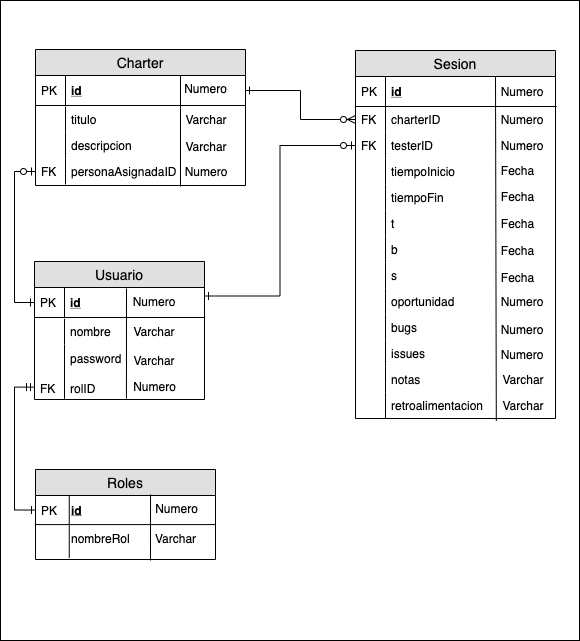
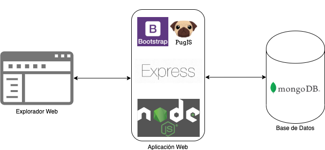

# Abstract

This prototype is an effort to build a tool that helps to manage all stages of Exploratory Testing using [Session Based Test Management, SBTM](https://www.satisfice.com/download/session-based-test-management) from the planning of a charter to the debrief of every session associated with that charter.

This is still a work in progress.

# Initial Design

## Main Page

## Create Charter Form

## Charter Page

## Execution Form

## Session Sheet

## Class Diagram

## Entity-Relation Diagram

## Architecture Diagram

# Initial steps to build the app

In order to get a working boilerplate using Node.js, MongoDB and Bootstrap I'm following James Hibbard's tutorial at [Sitepoint](https://www.sitepoint.com/build-simple-beginner-app-node-bootstrap-mongodb/).

The initial structure of the project is shown in the file [`initial-structure.txt`](design-documents/initial-structure.txt) in this repo. It will start evolving while I progress building this app, but for now the final structure of the prototype is in the file[`final-structure.txt`](design-documents/final-structure.txt).

In order to get my HTML code easily translated into Pug templates, I used [html2jade](https://github.com/donpark/html2jade).

# Steps to install the prototype in your local machine

The prototype was built as an auto-contained website to run locally in a personal computer for a single user.

In the future it will be extended to support authentication and then it can be securely deployed in a cloud instance to the use of a distributed team.

So the steps to run the application locally are:
1. Download and run the [Node.js](http://nodejs.org/) binary for your system (if not already installed).
2. Download and install [MongoDB Community Edition](https://docs.mongodb.com/manual/installation/) or create a [MongoDB Atlas Free Tier Cluster](https://docs.mongodb.com/manual/tutorial/atlas-free-tier-setup/#create-free-tier-manual)
3. (Optional) Download and install [MongoDB Compass Community](https://www.mongodb.com/download-center/compass?jmp=hero) to visualize your MongoDB instances.
4. (Optional) Download and run the [Git](https://git-scm.com/downloads) binary.
5. Get the URL to this repo with the green button at the top right of this page.
6. Open your command line terminal and navigate to the folder where you want to store this prototype.
6. Run the following command: `git clone {url_to_this_repo}`
7. Enter the prototype's folder with command: `cd explorer-tracker`
8. Run `npm install` to download all the dependencies.
9. Open a text file in the same folder and paste the following line: `DATABASE=mongodb://localhost:27017/explorer-tracker` (here `mongodb://localhost:27017/explorer-tracker` is the link to the database stored locally, you can change it to your instance in Atlas if you wish). Save it and make sure it stays secure in your filesystem.
10. If you're storing the database locally, start MongoDB with command: `mongod` (it might be necessary to run as root depending where the folder `\data\db` has been located).
11. Open another terminal window and run `npm run watch`
12. Open any web browser and navigate to http://localhost:3000/
13. Start using the prototype!

*Note:* if you're using a local database make sure you're properly backing up the `\data\db` directory.
